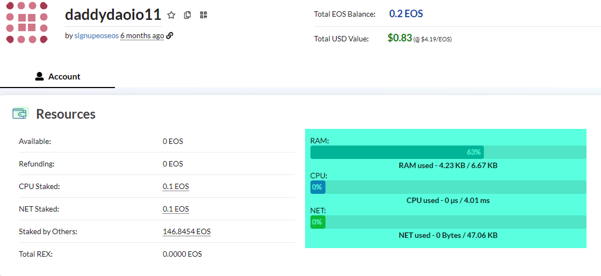
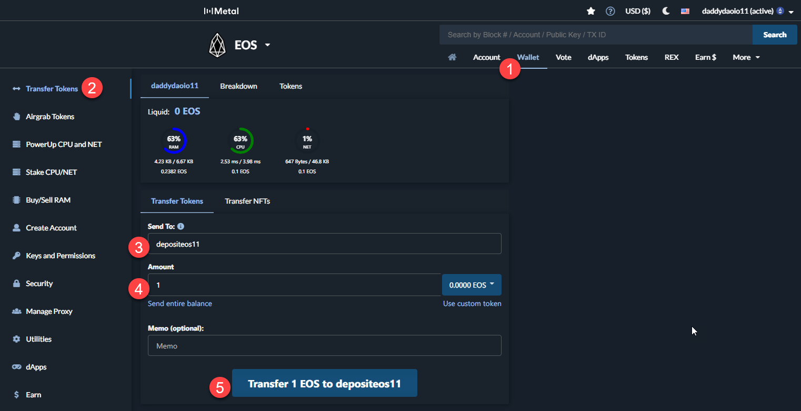
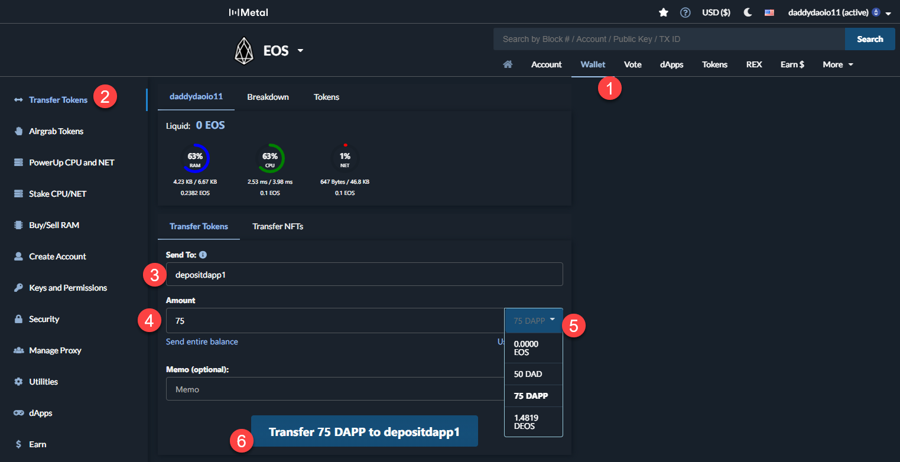
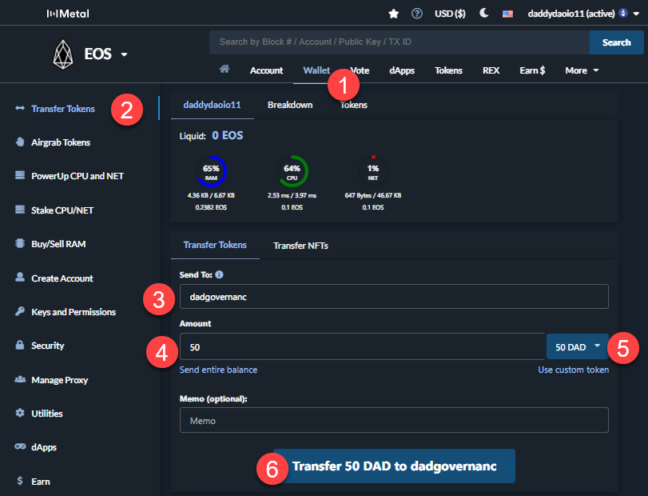
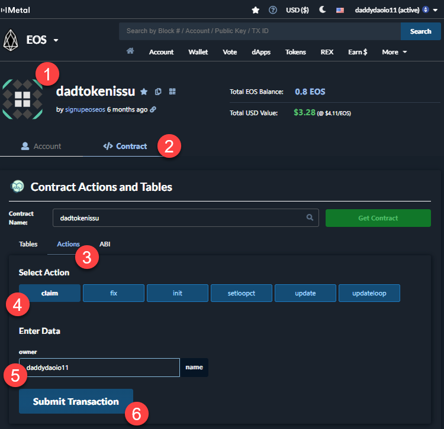
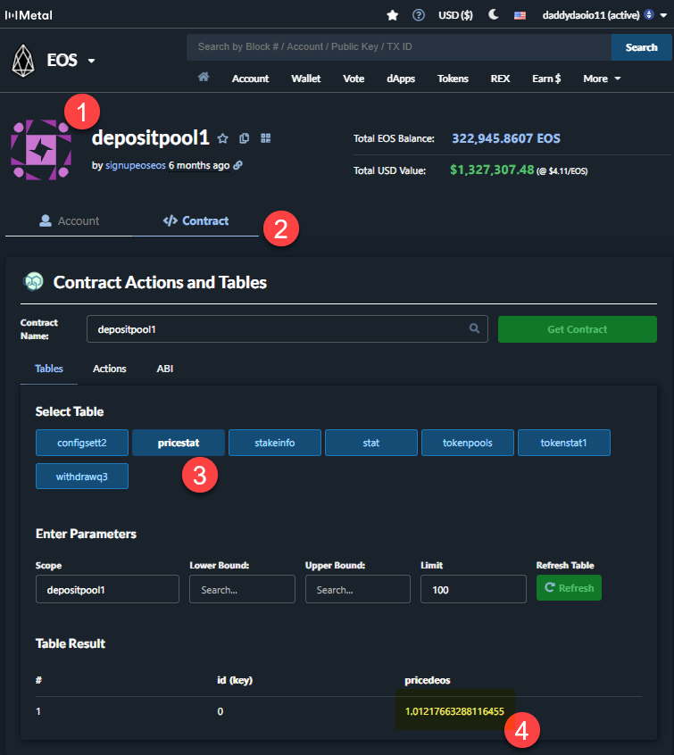

# How to interact with the DAPP Account DAO (DAD) Contracts

There are a few functions of the smart contracts. They are pretty straightforward and easy to use. If you do not want to use one of the front ends (https://DaddyDAO.io or https://SuperDad.finance) then you can use cleos or bloks.io to interact directly with smart contracts yourself. In this guide I will give you a step by step on how to do both of those.

First, for any of the 3 ways to interact with the contracts, make sure you have CPU and NET available on your account. You can use ( https://eospowerup.io/ ) to get a free power-up every 24 hours. 



Alternatively, you can stake your own EOS to get CPU and NET allocation.

These are the contracts we will be interacting with:

- dEOS: `depositeos11`
- dDAPP: `depositdapp1`
- DAD token contract: `dadtoken1111`
- Governance / voting contract: `dadgovernanc`
- Token Contract: `dadtokenissu`
- EOS Pool: `depositpool1`
- DAPP Pool: `depositpool2`

The basics of the DAO are that you can deposit DAPP or EOS to earn DAD token. You can then stake DAD token to have voting power for the DAO’s proposals. 

## Using Bloks.io

### Deposit EOS
For EOS we will use the `depositeos11` contract. All you do is transfer EOS to the `depositeos11` contract.


1. Click Wallet link
1. Click Transfer Token Link (it’s usually there by default)
1. In the `Send To` field type `depositeos11`
1. In the `Amount` field type the amount you want to transfer
1. Click Transfer and authenticate with whichever wallet you have connected to bloks.io

### Deposit DAPP

1. Click Wallet link
1. Click Transfer Token Link (it’s usually there by default)
1. In the “Send To” field type `depositdapp1`
1. In the “Amount” field type the amount you want to transfer
1. Use the drop down and select DAPP
1. Click Transfer and authenticate with whichever wallet you have connected to bloks.io

Just like with EOS you will get DDAPP back with the same USD value you deposited. Similar to EOS/DEOS the DAPP generates yield when deposited so the DDAPP are worth slightly more. The `pricestat` table is on the `depositpool2` contract. For more information see the above paragraph on dToken Value.

### Deposit DAD

1. Wallet tab on top navigation
1. Transfer Token Tab on left navigation
1. `dadgovernanc` in the “Send To” field
1. The amount you want to send
1. Make sure to choose DAD token in this drop down
1. Click the big button at the bottom to use the wallet you linked bloks.io to transfer the tokens.

For staking DAD you will NOT get any corresponding dTokens. The amount you stake is stored in a table on the `dadgovernanc` contract.

### Claim DAD
Every hour the contract calculates how much of the DAD emission should go to which account and adds it to the `claimtab2` table on the `dadtokenissu` contract.


1. Go to `dadtokenissu` account
1. Click the `Contract` tab
1. Click the `Actions` tab
1. Click the `claim` button
1. Enter your account name in the owner field
1. Click Submit Transaction


## Using cleos

### Deposit EOS
For EOS we will use the `depositeos11` contract. All you do is transfer EOS to the `depositeos11` contract. The cleos command will look like this:

```bash
cleos -u https://eos.greymass.com push transaction '{
  "delay_sec": 0,
  "max_cpu_usage_ms": 0,
  "actions": [
    {
      "account": "eosio.token",
      "name": "transfer",
      "data": {
        "from": "<YOUR ACCOUNT HERE>",
        "to": "depositeos11",
        "quantity": "<THE AMOUNT YOU WANT TO TRANSFER> EOS",
        "memo": ""
      },
      "authorization": [
        {
          "actor": "<YOUR ACCOUNT HERE>",
          "permission": "active"
        }
      ]
    }
  ]
}'
```

#### dToken Value
For instance in my demo deposit I deposited 1.5 EOS and received 1.4819 DEOS because 1 DEOS is worth 1.021766 EOS. This value can be found in the `pricestat` table on the `depositpool1` contract. See image below.  The DEOS tokens can be transferred between accounts just like EOS. Only the holder of DEOS tokens will receive the DAD tokens as a reward. 


1. Go to the `depositpool1` account
1. Click the `Contract` tab
1. Click the `pricestat` table
1. Note the `pricedeos` column.


### Deposit DAPP

The process is virtually identical to EOS except that you send tokens to `depositdapp1`.

```bash
cleos -u https://eos.greymass.com push transaction '{
  "delay_sec": 0,
  "max_cpu_usage_ms": 0,
  "actions": [
    {
      "account": "dappservices",
      "name": "transfer",
      "data": {
        "from": "<YOUR ACCOUNT HERE>",
        "to": "depositdapp1",
        "quantity": "<THE AMOUNT YOU WANT TO TRANSFER> DAPP",
        "memo": ""
      },
      "authorization": [
        {
          "actor": "<YOUR ACCOUNT HERE>",
          "permission": "active"
        }
      ]
    }
  ]
}'
```

### Deposit DAD
By depositing in either the EOS or DAPP pool will generate you both yield on the deposit, meaning you will usually get more EOS or DAPP back than you deposited AND you earn DAD token every hour.

To stake your DAD it’s the same exact process as EOS and DAPP except you are sending to `dadgovernanc` so the cleos command will look like this:

```bash
cleos -u https://eos.greymass.com push transaction '{
  "delay_sec": 0,
  "max_cpu_usage_ms": 0,
  "actions": [
    {
      "account": "dadtoken1111",
      "name": "transfer",
      "data": {
        "from": "<YOUR ACCOUNT HERE>",
        "to": "dadgovernanc",
        "quantity": "<THE AMOUNT YOU WANT TO TRANSFER> DAD",
        "memo": ""
      },
      "authorization": [
        {
          "actor": "<YOUR ACCOUNT HERE>",
          "permission": "active"
        }
      ]
    }
  ]
}'
```

### Claim DAD
Every hour the contract calculates how much of the DAD emission should go to which account and adds it to the `claimtab2` table on the `dadtokenissu` contract.

To claim you will use the claim action on the `dadtokenissu` contract.  The cleos command will look like this:

```bash
cleos -u https://eos.greymass.com push transaction '{
  "delay_sec": 0,
  "max_cpu_usage_ms": 0,
  "actions": [
    {
      "account": "dadtokenissu",
      "name": "claim",
      "data": {
        "owner": "<YOUR ACCOUNT HERE>"
      },
      "authorization": [
        {
          "actor": "<YOUR ACCOUNT HERE>",
          "permission": "active"
        }
      ]
    }
  ]
}'
```

